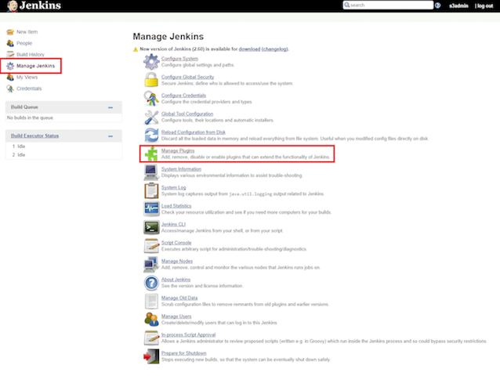
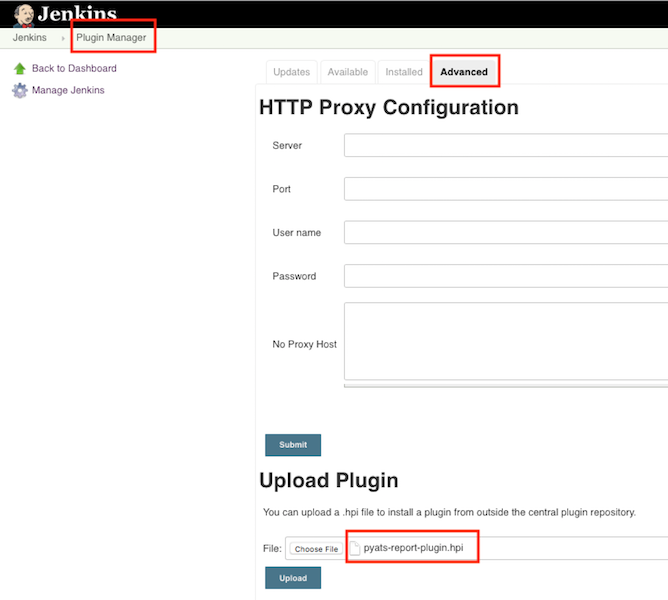

# Installation

## Requirement

- Linux environment
- Java 8
- Jenkins v2.54+

### Step 1:
Download the plugin (HPI) file from [downloads](../downloads/) folder.

### Step 2:
Log in Jenkins, click "Manage Jenkins" and choose "Manage Plugins" from the list.

### Step 3:
From the "Manage Plugins" select the "Advanced" tab.  In "Upload Plugin" section choose the _.hpi_ file downloaded in step #1, and click on "upload".  Follow through the steps prompted by Jenkins to complete the installation. No need to restart Jenkins service for new installation (restart Jenkins when upgrading/downgrading the plugin).

