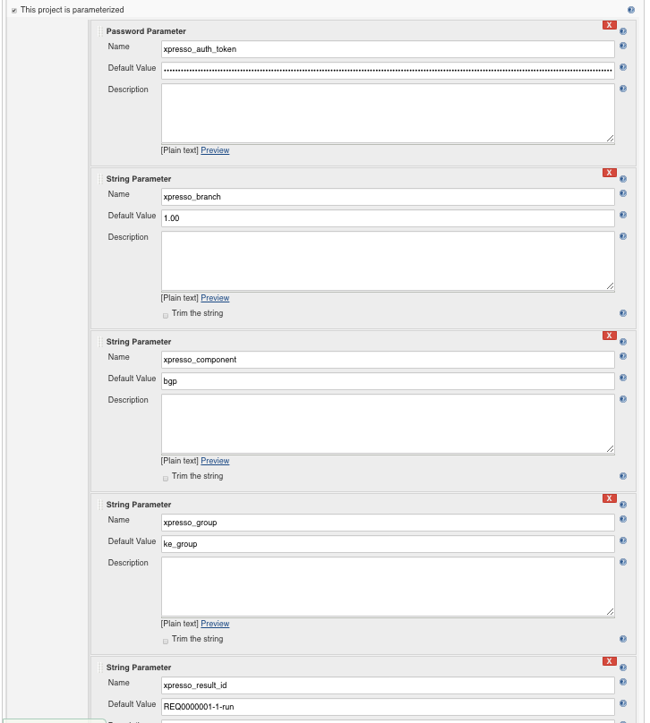
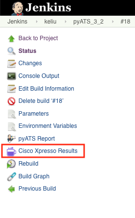

# Quick Start

## Step 1:
Navigate to project configuration, click on "Add post-build action" and select "Publish pyATS Report" from the list.

## Step 2:
Based on the project type (pyATS Project or Free style Project) the Report plugin interface will have minor differences depending on where the _test result archive (.zip)_ is saved.  The _pyATS Project_  saves the test results archive in Jenkins _workspace_ where as the _Free Styple Project plugin_ saves the Test result archive in user specified location. 

_Free Style project_:

* Specify the absolute path to the Test result archive file.  The file must be accessible from the build node (master/slave).
Report Plugin will validate the specified path, in the event of the file not being found/reachable from the current running node (master node), warning message displays. These warning message should be ignored if a _variable_ is used to specify the path, or the build and the archive file are located on remote/slave node.

## Step 3:

To upload the archive to the S3 portal specify:
* The S3 instance URL:
  * http://hostname
  * http://hostname:port
* The S3 top level *Request ID*  

### S3 Parameter Configuration

Uploading results to S3 requires REST API authentication. This is a mandatory parameter to be granted the uploading permission for Jenkins. The Authentication Token Parameters is specified through Jenkins native _Password Parameter_ component. Other optional S3 execution specific Parameters is specified through Jenkins native _String Parameter_ component.

S3 specific parameters are prefixed with *s3_* such as:  
* **s3_auth_token**: s3 automation token (mandatory parameter)
* **s3_branch**: indicating the image branch for the execution (optional parameter)
* **s3_component**: indicating the feature component the sanity job covers (optional parameter)
* **s3_group**: indicating the group for the execution (optional parameter, but needed when S3 *Request ID* is invalid)
* **s3_result_id**: indicating the result id the s3 will be using for uploading. Added for Autoeasy uploading support (optional parameter)

## Execution and Output

To execute the job, click "Build Now" on the project page:

### View Results on Jenkins
As the build is completed go to "Build Result Summary" page, click on Jenkins project *build number* to be redirected to  "build result summary" page.  

Example of "Build Result Summary" output: 

The general information of the job, the report provides the overall result (pass/fail percentage) of the run. Click the **Build # pyATS report** link to view the details of each Test. 

### View results from Cisco Self Serve Services (S3) dashboard
Click "Cisco S3 Result" will go directly to S3 instance the result is uploaded to.

  
